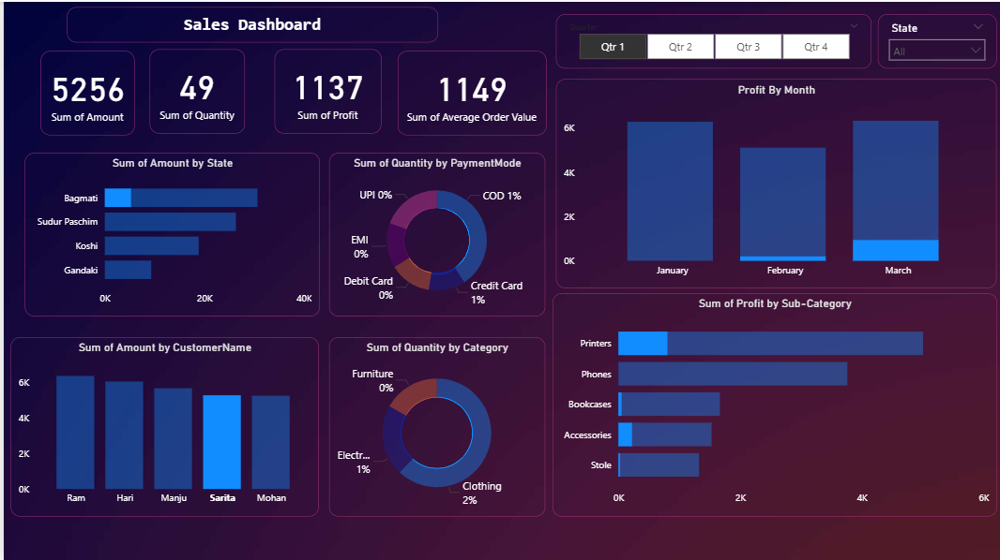

# 📊 Power BI Sales Dashboard

This project contains an **interactive Sales Dashboard built using Microsoft Power BI** to analyze sales performance, customer trends, and product profitability.

---

## 📷 Dashboard Preview

---

## 📌 Project Overview

The dashboard provides insights into:

- Total Sales Amount
- Quantity of Products Sold
- Profit Analysis
- Average Order Value
- Sales by State
- Sales by Customer
- Profit by Sub-category
- Payment Mode Distribution

It allows users to filter data by:

- Quarter
- State

---

## 📈 Key Dashboard Metrics

| Metric | Description |
|------|------|
| Sum of Amount | Total revenue generated |
| Sum of Quantity | Total products sold |
| Sum of Profit | Net profit generated |
| Average Order Value | Average revenue per order |

---

## 📊 Visualizations Used

The dashboard includes the following visualizations:

- KPI Cards
- Bar Charts
- Donut Charts
- Profit Trend by Month
- Category Distribution
- Customer Sales Comparison

---

## 🛠 Tools Used

- **Microsoft Power BI**
- Data Modeling
- Data Visualization
- Interactive Filters

---

## 🚀 How to Use

1. Download the `.pbix` file
2. Open it using **Microsoft Power BI Desktop**
3. Explore the interactive dashboard

---

